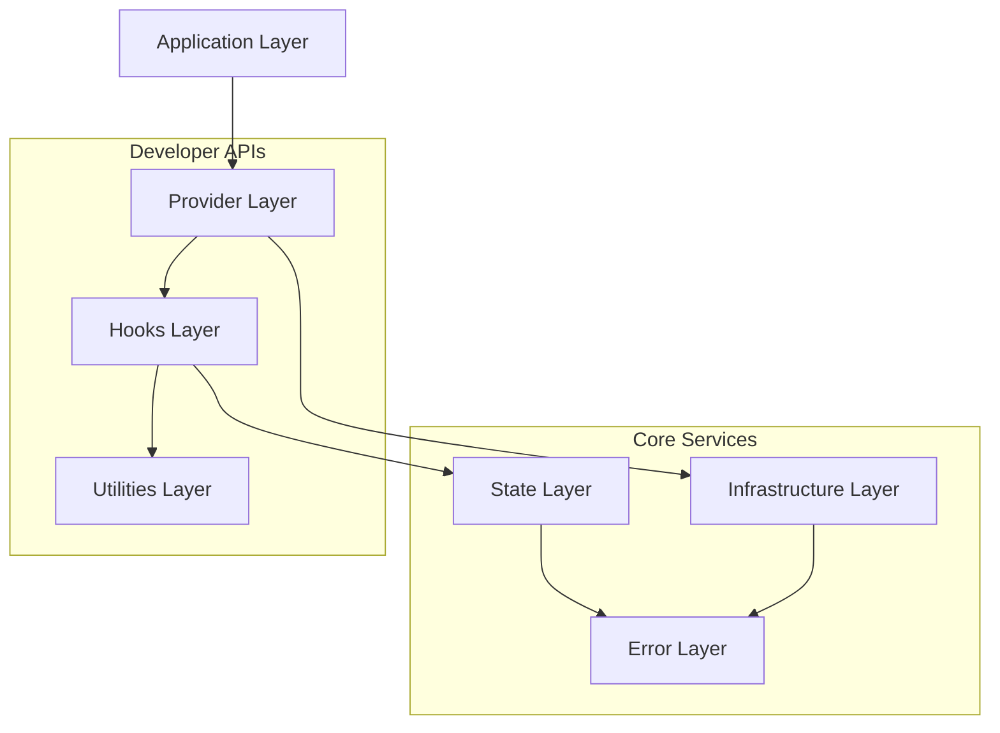
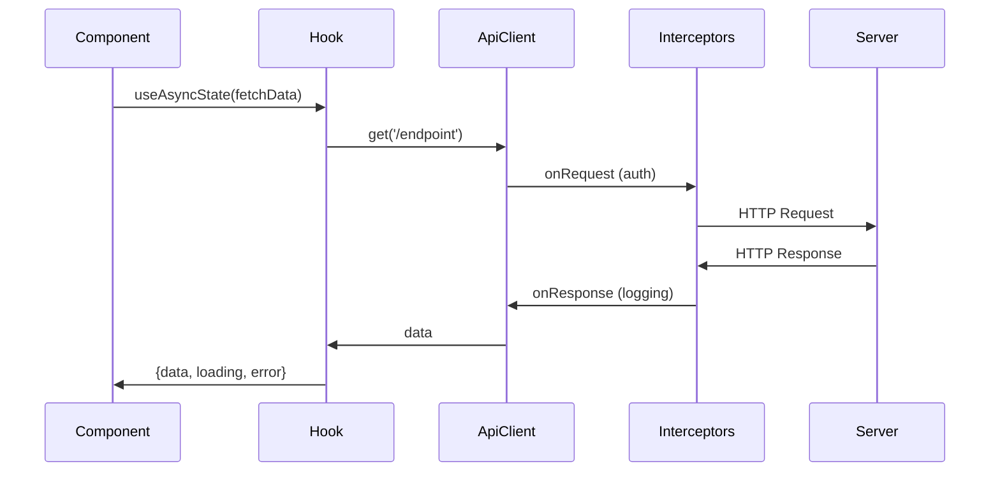
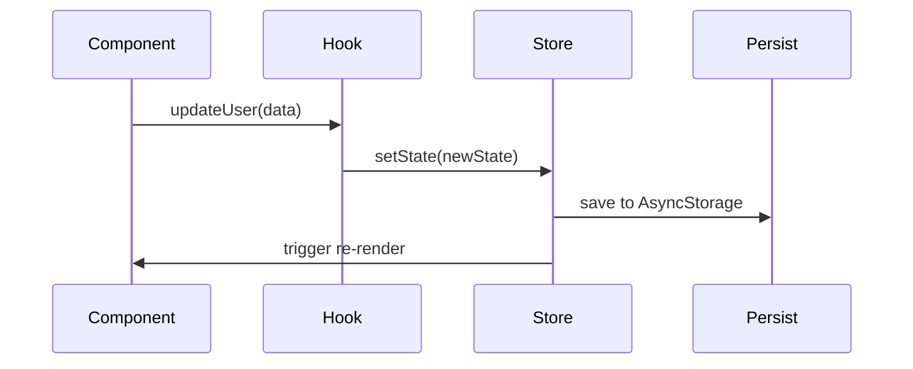

# Architecture

## Overview

opticore-react-native is built as a **layered infrastructure library** following clean architecture principles with strict separation of concerns.

## System Architecture



## Layer Breakdown

### 1. Infrastructure Layer (`src/infrastructure/`)

**Purpose**: Core services for networking, storage, logging, and device monitoring.

**Modules**:
- **ApiClient** - HTTP client wrapper (Axios-based)
  - Interceptors for auth, logging, error handling
  - Singleton pattern
  - Automatic token refresh
- **StorageManager** - Unified storage interface
  - AsyncStorage for general data
  - SecureStore for sensitive data
- **Logger** - Structured logging
  - Level-based (debug, info, warn, error)
  - Remote logging integration ready
- **ConnectivityManager** - Network state monitoring
- **LifecycleManager** - App state tracking

**Pattern**: Singleton services with dependency injection via configuration.

---

### 2. State Layer (`src/state/`)

**Purpose**: State management patterns and stores built on Zustand.

**Modules**:
- **AsyncState** - Pattern for async operations
  - Loading, error, data states
  - Automatic error handling
- **BaseStore** - Zustand store foundation
  - Devtools integration
  - Persistence support
- **StateObserver** - State change listener
- **StoreFactory** - Store creation utilities

**Pattern**: Functional state management with immutable updates (Immer).

---

### 3. Error Layer (`src/error/`)

**Purpose**: Error classification and handling.

**Classes**:
```typescript
BaseError (abstract)
├── RenderError      // Show to user
└── NonRenderError   // Log only
    ├── ApiError
    └── ValidationError
```

**Pattern**: Error inheritance with classification for UI vs logging.

---

### 4. Provider Layer (`src/providers/`)

**Purpose**: React context providers for app-wide services.

**Components**:
- **CoreProvider** - Wraps all infrastructure
  - ApiClient initialization
  - Network monitoring
  - Lifecycle tracking
- **QueryProvider** - React Query configuration
  - Caching strategy
  - Retry logic
  - Optimistic updates

**Pattern**: Composition of providers with sensible defaults.

---

### 5. Hooks Layer (`src/hooks/`)

**Purpose**: Custom React hooks for common patterns.

**Categories**:
- **Async**: `useAsyncState`, `useAsync`
- **Performance**: `useDebounce`, `useThrottle`
- **Device**: `useConnectivity`, `useKeyboard`, `useOrientation`
- **Lifecycle**: `useAppState`, `useLifecycle`
- **Utilities**: `usePrevious`, `useToggle`

**Pattern**: Hooks encapsulate side effects and return controlled state.

---

### 6. Utilities Layer (`src/utils/`)

**Purpose**: Pure functions for data transformation.

**Modules**:
- **STRING**: capitalize, truncate, slugify, etc.
- **DATE**: formatDate, isToday, getDaysBetween, etc.
- **ARRAY**: chunk, unique, groupBy, etc.
- **OBJECT**: deepMerge, pick, omit, etc.
- **COLOR**: hexToRgb, adjustOpacity, etc.
- **NUMBER**: clamp, round, formatCurrency, etc.
- **PLATFORM**: Platform-specific helpers

**Pattern**: Tree-shakable pure functions with no side effects.

---

### 7. Configuration Layer (`src/config/`)

**Purpose**: App configuration and setup.

**Modules**:
- **CoreSetup** - Main configuration entry
  - API settings
  - Storage settings
  - Logging settings
- **ConfigValidator** - Validate configuration
- **SpecialModes** - Development modes (demo, testing)

**Pattern**: Centralized configuration with validation.

---

## Data Flow

### API Call Flow


### State Update Flow


---

## Design Patterns

### 1. Singleton Pattern
Used for: ApiClient, Logger, StorageManager

**Why**: Single instance ensures consistent state across app.

### 2. Observer Pattern
Used for: ConnectivityManager, LifecycleManager, StateObserver

**Why**: Decouples event sources from handlers.

### 3. Factory Pattern
Used for: StoreFactory, error creation

**Why**: Encapsulates object creation logic.

### 4. Provider Pattern
Used for: CoreProvider, QueryProvider

**Why**: Dependency injection for React components.

### 5. Hook Pattern
Used for: All custom hooks

**Why**: Reusable stateful logic without HOCs.

---

## Extension Points

### 1. Custom Interceptors
Add your own request/response interceptors:

```typescript
apiClient.client.interceptors.request.use(customInterceptor);
```

### 2. Custom Stores
Extend BaseStore for domain-specific state:

```typescript
export const useUserStore = create<UserState>((set) => ({
  // your  state
}));
```

### 3. Custom Error Types
Extend BaseError for domain-specific errors:

```typescript
export class PaymentError extends RenderError {
  // custom error
}
```

### 4. Custom Hooks
Compose existing hooks or create new ones:

```typescript
export function useCustomHook() {
  const async = useAsyncState(fetchData);
  const debounced = useDebounce(value, 500);
  return { async, debounced };
}
```

---

## Dependencies

### Production Dependencies
- `axios` - HTTP client
- `zustand` - State management
- `@tanstack/react-query` - Server state
- `immer` - Immutable updates
- `date-fns` - Date utilities
- `@react-native-async-storage/async-storage` - Storage
- `expo-secure-store` - Secure storage

### Peer Dependencies
- `react` 19+
- `react-native` 0.78+
- `expo` 54+
- `typescript` 5+

---

## Testing Architecture

See [Testing Guide](./Testing.md) for full details.

**Test Structure**:
- Unit tests: `test/**/*.test.ts`
- Mocks: `test/__mocks__/infrastructure/`
- Helpers: `test/helpers/`
- Coverage: 83.73% (target: 80%+)

---

## Build & Distribution

**Build Process**:
1. TypeScript compilation (`tsc`)
2. Type declarations generation
3. Tree-shaking via ES modules

**Output**: `dist/` directory with:
- `dist/src/index.js` - Main entry
- `dist/src/index.d.ts` - Type definitions
- Subpath exports for utils, hooks, etc.

---

## Performance Considerations

1. **Tree-Shaking**: All utilities are tree-shakable
2. **Lazy Loading**: Providers initialize only when needed
3. **Memoization**: Hooks use useMemo/useCallback appropriately
4. **Bundle Size**: <50KB gzipped

---

## Security

1. **Secure Storage**: Sensitive data uses expo-secure-store
2. **Token Management**: Automatic token refresh with secure storage
3. **Input Validation**: All config validated before use
4. **Error Sanitization**: Sensitive data removed from error logs

See [SECURITY.md](../SECURITY.md) for security policy.
